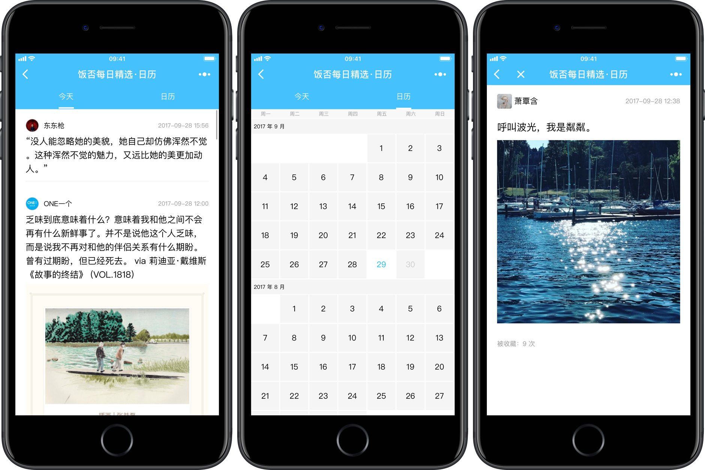

  <h1>「饭否每日精选·日历」微信小程序</h1>
   
  

    
       
    <a href="http://fanfou-daily.leanapp.cn/d/today">扫码访问</a>
    
   

## 相关 blog 文章
1. [笔记：「饭否精选」微信小程序（一）制作记录](http://movii.github.io/blog/2017/06/01/没能上线的小程序-饭否精选日历/)
2. [笔记：「饭否精选」微信小程序（二）爬虫部分](http://movii.github.io/blog/2017/06/15/fanfou-daily-wechat-log-scrapy/)
3. [笔记：「饭否精选」微信小程序（三）小程序开发中遇到的问题](http://movii.github.io/blog/2017/07/15/fanfou-daily-wechat-min-program/)
</aside>